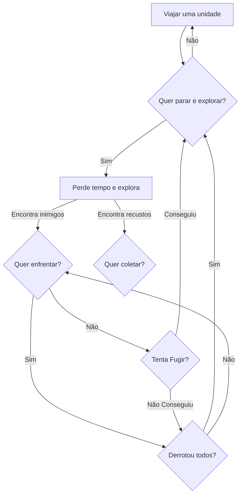

# Ideia do Jogo

O jogador é constituido por várias caracteristicas, sendo as mais notórias **Vida**, **Mana**, **Energia**, **Attack**, **Defesa** e **XP**.
Estes atributos são usados para várias atividades que o jogador pode realizar ao longo do jogo.

***Exemplo***: Estamos a passar pela **floresta** para chegar a cidade vizinha podemos aproveitar o tempo e **explorar a área** para ver se encontramos alguns cogumelos ou bagas (**Recursos**), para tal usamos **energia**, são usadas as capacidade de **coleta** e **exploração** enquanto exploramos podemos ter o azar e ser surpreendeidos por **inimigos** que estavam na área, então teremos que enfrentalos ou tentar fugir e despistalos.

O **Mundo** funciona por **unidades métricas especificas**, cada unidade viajada faz o tempo do dia avançar **um periodo de tempo fixo**, algumas das acções que o jogador faz também. No mapa do mundo exitstem alguns vários tipos de objetivos diferentes sendo eles **cidades**, **dungeons**, e **acampamentos inimigos**.

# Detalhes

## Atributos

## XP

Pontos de **Xp** definem quanta experiencia a entidade já obteu, estes podem ser obtidos através de

### Vida

Pontos de **Vida** que a entidade tem se chegar a 0 a entidade morre.

### Vida máxima

Máximo de **Vida** que a entidade pode regenerar/recuparar naturalmente, este valor pode ser depois expandido atravez da **súbida de nível** e ou efeitos temporários.

